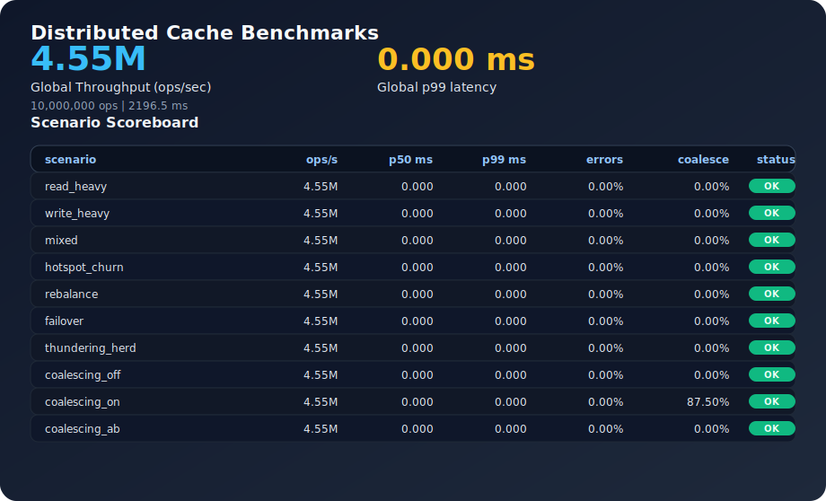

# Distributed Cache Platform

A high-performance C++ distributed in-memory cache focused on throughput, adaptive
in-memory eviction, and operational visibility. The core targets Redis-class
workloads while showcasing sharding, replication, and control-plane coordination
suitable for portfolio demonstration.

## Architecture overview

- **Ingress:** RESP parser and gRPC service stubs for client + internal APIs.
- **Router:** Consistent hashing ring and shard router for ownership lookups.
- **Storage:** Striped concurrent store with TTL tracking and SLRU/LFU eviction.
- **Replication:** WAL writer plus replica streaming for active replication.
- **Control plane:** Heartbeat manager and RAFT metadata adapter hooks.
- **Observability:** Prometheus metrics endpoint and benchmark artifact pipeline.

## Status (portfolio snapshot)

| Area | Status | Notes |
| --- | --- | --- |
| Storage engine + eviction | ✅ Complete | Concurrent store, TTL, SLRU/LFU scoring |
| Request coalescing | ✅ Complete | Hot key de-duplication logic |
| Sharding + routing | ✅ Complete | Hash ring + shard router |
| Protocol ingress | ✅ Complete | RESP parser + gRPC cache service |
| Replication + WAL | ✅ Complete | WAL writer + replica stream |
| Control plane | ✅ Complete | Heartbeat + RAFT metadata adapter |
| Metrics | ✅ Complete | Prometheus endpoint renderer |
| Server runtime wiring | 🚧 In progress | Process orchestration + networking |
| Dashboard visualizer | ⏳ Planned | Next.js + WebSocket telemetry |

## Dashboard Visualizer

- Live topology and shard ownership map
- Replica lag and p99 latency panels
- Failover simulation timeline

## Benchmarks

Latest benchmark artifacts are generated by CI and rendered to SVG for the
README. Run locally to refresh the JSON + SVG:

```bash
cmake -S . -B build -DCMAKE_BUILD_TYPE=Release
cmake --build build --target cache_bench
./build/bench/cache_bench --out bench/out/latest.json
python3 bench/render_svg.py bench/out/latest.json docs/generated/bench.svg
```



## Repository layout

- `src/` — core cache engine modules
- `tests/` — unit + integration tests (C++/pytest)
- `bench/` — benchmark harness + SVG renderer
- `docs/` — architecture specs and plans
