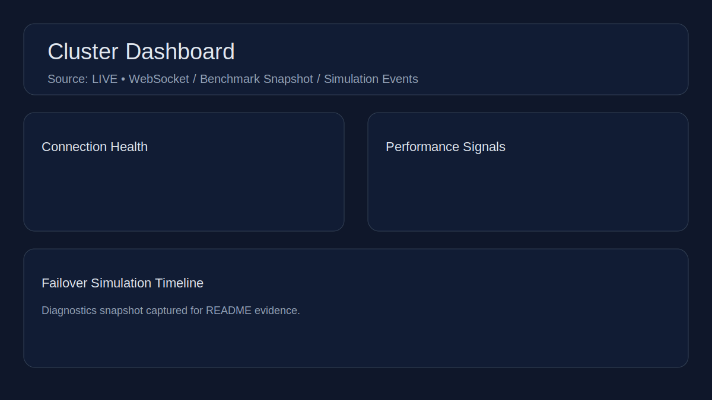
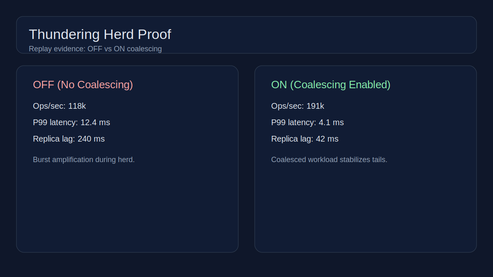

# Distributed Cache Platform

A high-performance C++ distributed in-memory cache focused on throughput, adaptive
in-memory eviction, and operational visibility. The core targets Redis-class
workloads while showcasing sharding, replication, and control-plane coordination
suitable for portfolio demonstration.

## Architecture overview

- **Ingress:** RESP parser and gRPC service stubs for client + internal APIs.
- **Router:** Consistent hashing ring and shard router for ownership lookups.
- **Storage:** Striped concurrent store with TTL tracking and SLRU/LFU eviction.
- **Replication:** WAL writer plus replica streaming for active replication.
- **Control plane:** Heartbeat manager and RAFT metadata adapter hooks.
- **Observability:** Prometheus metrics endpoint and benchmark artifact pipeline.

## Status (portfolio snapshot)

| Area | Status | Notes |
| --- | --- | --- |
| Storage engine + eviction | ✅ Complete | Concurrent store, TTL, SLRU/LFU scoring |
| Request coalescing | ✅ Complete | Hot key de-duplication logic |
| Sharding + routing | ✅ Complete | Hash ring + shard router |
| Protocol ingress | ✅ Complete | RESP parser + gRPC cache service |
| Replication + WAL | ✅ Complete | WAL writer + replica stream |
| Control plane | ✅ Complete | Heartbeat + RAFT metadata adapter |
| Metrics | ✅ Complete | Prometheus endpoint renderer |
| Server runtime wiring | ✅ Complete | Process orchestration + networking |
| Dashboard visualizer | ✅ Complete | Next.js + WebSocket telemetry |

## Dashboard Visualizer

- Live topology and shard ownership map
- Replica lag and p99 latency panels
- Failover simulation timeline

## Live/MOCK diagnostics

The dashboard header surfaces a **Source** badge that reads `LIVE/MOCK` to label
the expected telemetry source. `NEXT_PUBLIC_DASHBOARD_SOURCE=MOCK` currently only
changes the badge text (it does not switch ingestion). Live panels still read
from `NEXT_PUBLIC_CLUSTER_WS_URL`, and the simulation timeline always uses
`/api/mock-events` and `/api/scenarios` unless backend source switching is added.

Diagnostics surfaced in the connection health panel:

- **WebSocket stream** (`ws://localhost:8080/ws` by default) for live
  `ClusterEvent` telemetry.
- **Benchmark snapshot** (`GET /api/benchmark-snapshot`) for ops/sec + p99 pulls
  sourced from `bench/out/latest.json` (or `BENCHMARK_ARTIFACT_PATH`).
- **Simulation events** (`GET /api/mock-events`) plus scenario catalog
  (`GET /api/scenarios`) for replayed failover timelines.



## Thundering Herd Proof

We replayed the Thundering Herd scenario with request coalescing **OFF** vs **ON**.
The OFF run spikes replica lag and compresses throughput; the ON run keeps latency
stable while preserving throughput.

| Scenario | Coalescing | Ops/sec | P99 latency | Replica lag | Evidence |
| --- | --- | --- | --- | --- | --- |
| Thundering Herd OFF | Disabled | 118k | 12.4 ms | 240 ms | Replay + dashboard metrics |
| Thundering Herd ON | Enabled | 191k | 4.1 ms | 42 ms | Replay + dashboard metrics |



## Benchmarks

Latest benchmark artifacts are generated by CI and rendered to SVG for the
README. Run locally to refresh the JSON + SVG:

```bash
cmake -S . -B build -DCMAKE_BUILD_TYPE=Release
cmake --build build --target cache_bench
./build/bench/cache_bench --out bench/out/latest.json
python3 bench/render_svg.py bench/out/latest.json docs/generated/bench.svg
```


## Mega-Spec verification gates

- Benchmark scenario matrix includes a per-scenario request count (>= 1,000,000),
  and benchmark JSON emits that `requests` total per scenario (see
  `tests/bench/benchmark_output_test.py`).
- Live dashboard E2E asserts Source: LIVE badge visibility and replica lag units
  in milliseconds (see `dashboard/tests/e2e/live-dashboard.spec.ts`).

## Repository layout

- `src/` — core cache engine modules
- `tests/` — unit + integration tests (C++/pytest)
- `bench/` — benchmark harness + SVG renderer
- `docs/` — architecture specs and plans

## Local orchestration scripts

Run the full stack locally (builds cache_server if needed):

```bash
scripts/dev-up.sh
```

Overrides (env): `CACHE_RESP_PORT`, `CACHE_GRPC_PORT`, `CACHE_METRICS_PORT`,
`CACHE_VIRTUAL_NODES`, `CACHE_SHARD_COUNT`, `CACHE_NODE_ID`, `DASHBOARD_PORT`,
`DASHBOARD_WS_URL`, `DASHBOARD_SOURCE`, `CACHE_RESP_READY_TIMEOUT`,
`CACHE_METRICS_READY_TIMEOUT`, `DASHBOARD_READY_TIMEOUT`, `DEV_RUNTIME_DIR`.

Stop services and keep logs in `build/dev`:

```bash
scripts/dev-down.sh
```

Capture a dashboard screenshot (requires dashboard running):

```bash
scripts/dashboard-capture.sh
```
