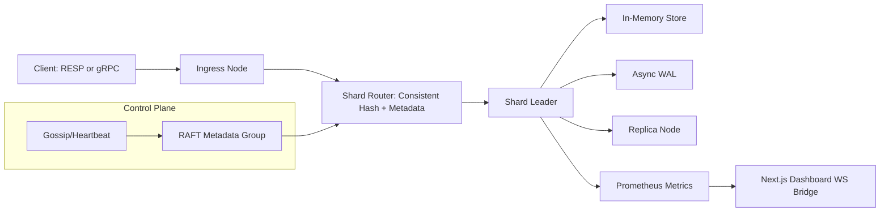
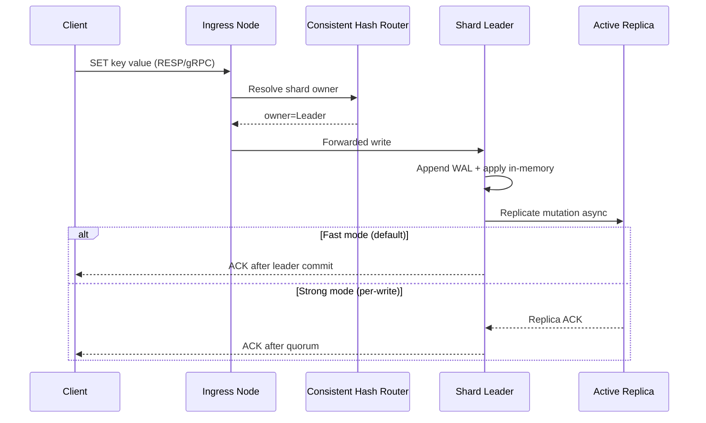

# Distributed Cache Platform Design (Core + Parallel Dashboard Track)

## 1. Problem Statement

Build a high-performance distributed in-memory cache in C++ with Redis-class core capabilities: concurrent access, adaptive eviction, sharding, replication, failure handling, and strong observability.  
The system should prioritize throughput while allowing stronger per-write durability when needed.

This spec covers:

1. Core C++ distributed cache platform
2. Parallel v1 dashboard contract (Next.js + TypeScript + WebSockets)
3. Benchmark/CI/README portfolio instrumentation

## 2. Discovery Audit (Current Codebase Status)

Repository audit results:

### [DONE]

1. Git repository initialized
2. Main branch exists with initial commit
3. Top-level `README.md` placeholder exists

### [IN-PROGRESS]

1. Architecture and design baseline (this document)

### [TODO]

1. Core hash map storage engine
2. Concurrency layer (striped locking / RW locking strategy)
3. Adaptive eviction (segmented LRU + LFU-aware scoring)
4. Consistent hashing + virtual nodes
5. Cluster metadata & shard ownership
6. Dual protocol ingress (RESP + gRPC)
7. Asynchronous WAL
8. Active-replica data replication
9. RAFT-led control plane for membership/ownership
10. Gossip/heartbeat health tracking
11. Request coalescing (thundering herd protection)
12. Prometheus metrics endpoint
13. Benchmark harness + CI-generated SVG results
14. Production-quality README
15. Next.js dashboard visualizer + simulation tools

## 3. Goals and Non-Goals

### Goals

1. Throughput-first performance with acceptable p99 latency
2. Horizontal scalability with minimal key remapping
3. Fault-aware writes with configurable consistency per request
4. Operational observability suitable for portfolio demonstration

### Non-Goals (v1)

1. Disk-first persistence database semantics
2. Multi-region transactional guarantees
3. General-purpose SQL/query interface

## 4. Architecture Overview

Approach selected: **RAFT control-plane + leader/WAL data-plane**, with async replication by default and optional stronger write acknowledgment.

## 5. Major Modules

1. **Storage Engine (C++)**
   - Sharded in-memory key/value map
   - TTL and metadata tracking
   - Request coalescing registry

2. **Eviction Manager**
   - Segmented LRU (probation/protected queues)
   - LFU-influenced victim scoring
   - TinyLFU-style admission gate under memory pressure

3. **Cluster Router**
   - Consistent hashing ring with virtual nodes
   - Ownership lookup by key
   - Rebalance hooks for node join/leave

4. **Protocol Layer**
   - RESP parser/encoder for Redis-compatible clients
   - gRPC service for typed client and internal control APIs

5. **Replication + WAL**
   - Leader append to WAL before apply
   - Async stream replication to active replica(s)
   - Replica lag accounting and replay windows

6. **Control Plane**
   - RAFT for cluster metadata consistency (membership + shard ownership)
   - Heartbeat/gossip for liveness inputs into ownership decisions

7. **Observability**
   - Prometheus endpoint for cache/replication/WAL stats
   - Benchmark exporter generating machine-readable outputs for CI badges

8. **Dashboard (Node.js)**
   - Next.js + TypeScript frontend
   - WebSocket live topology/health/lag stream
   - Simulation playback for failover and rebalancing narratives

## 6. Data Flow: `SET` Request

## 7. Consistency Model (Speed vs Integrity)

1. **Default mode (fast):** return success after leader WAL+apply.
   - Highest throughput, lower write latency.
   - Accepts short replication lag windows.

2. **Strong mode (opt-in per write):** require replica quorum acknowledgment before client ACK.
   - Better durability/visibility guarantees.
   - Higher latency, lower peak throughput.

3. **Read semantics:** configurable eventual vs leader-only read paths in API surface.

## 8. Memory Strategy

1. **Admission:** TinyLFU-style gate to reduce pollution from low-reuse keys.
2. **Retention:** segmented LRU:
   - Probation segment for newly admitted entries
   - Protected segment for repeatedly accessed entries
3. **Frequency bias:** LFU counters influence eviction scoring within segments.
4. **Pressure controls:**
   - Namespace-level quotas
   - Soft-limit backpressure before hard eviction spikes
   - Prometheus visibility into evictions, hit ratio, and memory fragmentation

## 9. Concurrency Model

1. Partition keyspace into shards; each shard has isolated synchronization.
2. Use RW locks for read-dominant structures and mutexes for mutation-critical paths.
3. Keep lock scope tight; avoid global locks in hot request path.
4. Request coalescing table deduplicates in-flight misses/writes on hot keys to reduce stampedes.

## 10. Fault Tolerance

1. Heartbeat/gossip detects node liveness degradation.
2. RAFT control-plane commits membership/ownership changes.
3. Shard leadership transitions are metadata-driven and deterministic.
4. Replay from WAL and replica catch-up support recovery.

## 11. Performance and Benchmarking Plan

Benchmark dimensions:

1. Ops/sec by operation mix (GET-heavy, mixed, write-heavy)
2. p50/p95/p99 latency
3. Replication lag under failure injection
4. Rebalance impact (key movement + latency disturbance)
5. Coalescing effectiveness under thundering-herd workloads

CI pipeline outputs benchmark artifacts, converts key metrics to SVG badges/charts, and embeds them in README.

## 12. Dashboard and Portfolio Layer

1. Live cluster graph (nodes, shard owners, replica health)
2. Heatmaps for hotspot keys and eviction churn
3. Timeline visualization for failover events
4. Benchmark scenario playback (before/after tuning)
5. Feature “Why” annotations:
   - Why consistent hashing over modulo
   - Why dual consistency modes
   - Why RAFT for control plane ownership

## 13. Risks and Mitigations

1. **Complexity creep from broad scope**
   - Mitigation: deliver in execution slices with strict boundaries.
2. **RAFT + replication interaction bugs**
   - Mitigation: isolate control-plane metadata from data-plane replication code paths.
3. **Performance regressions during feature growth**
   - Mitigation: automate benchmark gates and track trend diffs in CI.

## 14. Execution Slices

1. **Slice A (Core engine):** storage, concurrency, eviction, RESP/gRPC ingress
2. **Slice B (Distributed core):** hashing, replication, WAL, RAFT metadata, heartbeat/gossip
3. **Slice C (Observability/perf):** Prometheus, benchmark runner, CI SVG + README integration
4. **Slice D (Dashboard):** Next.js visualization and simulations wired to live metrics/events
